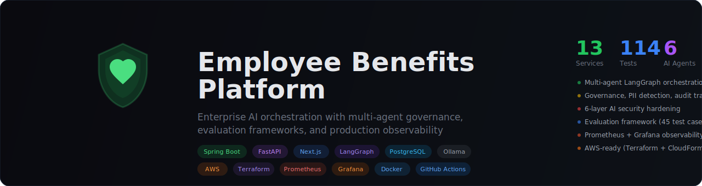

<p align="center">
  
</p>

<p align="center">
  <a href="LICENSE"></a>
  <a href="https://openjdk.org/"></a>
  <a href="https://spring.io/projects/spring-boot"></a>
  <a href="https://nextjs.org/"></a>
  <a href="https://www.python.org/"></a>
</p>

A cloud-native platform for processing employee benefit enrollments, built with Spring Boot microservices, an event-driven architecture, and an AI-powered chatbot. The system accepts enrollment requests, persists them durably, and drives downstream processing through an outbox/inbox messaging pattern — designed to evolve toward AWS EventBridge, SQS, and saga orchestration without breaking the external API.

## Why This Architecture

Employee benefit enrollments are high-stakes, low-tolerance-for-loss transactions. This platform treats every enrollment as a durable event:

- **No silent failures** — the transactional outbox guarantees that every accepted enrollment is eventually delivered downstream, even if the processing service is temporarily unavailable.
- **Idempotent processing** — the inbox pattern ensures duplicate deliveries are safely ignored.
- **Cloud-ready boundaries** — the local HTTP transport can be swapped for EventBridge + SQS without changing the enrollment API, the data model, or the processing logic.
- **AI-augmented** — an integrated chatbot with RAG knowledge base, MCP tools, and multi-layer security guardrails helps employees navigate their benefits.

## Architecture

```
┌─────────────────┐       ┌───────────────────────────────────────────────┐
│  Browser /      │       │            Enrollment Service                 │
│  Frontend :3000 │──────▶│  REST API → DB + Outbox → Dispatcher          │
└────────┬────────┘       │            Publisher Adapter(http|eventbridge)│
         │                └───────────────────┬───────────────────────────┘
         │                                    │
         │                 ┌──────────────────▼───────────────────────────┐
         │                 │           Processing Service                 │
         │                 │  Event Controller → Inbox → Processing DB    │
         │                 └──────────────────────────────────────────────┘
         │
         │                 ┌──────────────────────────────────────────────┐
         └────────────────▶│           AI Platform                        │
                           │  AI Gateway :8200 → Ollama (LLM)             │
                           │  MCP Server :8100 → Benefits APIs            │
                           │  Knowledge Service :8300 → pgvector (RAG)    │
                           └──────────────────────────────────────────────┘
                                              │
                           ┌──────────────────▼───────────────────────────┐
                           │           PostgreSQL 16 + pgvector           │
                           │  enrollment · messaging · processing         │
                           │  knowledge · orchestration (future)          │
                           └──────────────────────────────────────────────┘
```

Detailed architecture diagrams (Mermaid) are in [docs/system-architecture.md](docs/system-architecture.md).

## Quick Start

**Prerequisites:** Java 17+, Docker, and a few minutes.

```bash
# 1. Clone the repo
git clone https://github.com/skbcoder/employee-benefits-platform.git
cd employee-benefits-platform

# 2. Run the setup script (detects/installs prerequisites, creates .env, builds project)
./scripts/setup.sh

# 3. Start services
./scripts/run-local.sh
```

The setup script checks for Java, Docker, Python, Node.js, and Ollama — installs what's missing (with your confirmation), creates `.env`, starts PostgreSQL, builds the Java services, sets up Python venvs, and pulls Ollama models. Run `./scripts/setup.sh --check` to see what's installed without changing anything.

Health checks:
```bash
curl http://localhost:8080/actuator/health   # Enrollment Service
curl http://localhost:8081/actuator/health   # Processing Service
```

Submit a test enrollment:
```bash
curl -X POST http://localhost:8080/api/enrollments \
  -H "Content-Type: application/json" \
  -d '{
    "employeeId": "E12345",
    "employeeName": "Jane Doe",
    "employeeEmail": "jane@example.com",
    "selections": [
      { "type": "medical", "plan": "gold" },
      { "type": "dental", "plan": "basic" }
    ]
  }'
```

### Full Stack (with AI + Frontend)

```bash
# Requires: Python 3.11+, Node.js 20+, Ollama

# Start AI Platform
./scripts/run-local.sh --with-ai

# Start Frontend (separate terminal)
cd frontend && npm install && npm run dev
```

The UI is at `http://localhost:3000` with an AI chatbot that can answer benefits questions, look up enrollments, and explain plan details.

For the complete setup guide with troubleshooting, see [docs/local-setup.md](docs/local-setup.md).

## Services

| Service | Port | Tech | Description |
|---------|------|------|-------------|
| **Enrollment Service** | 8080 | Spring Boot / Java 17 | Enrollment REST API, outbox dispatcher, publisher adapters |
| **Processing Service** | 8081 | Spring Boot / Java 17 | Event consumer, inbox idempotency, async processing |
| **AI Gateway** | 8200 | FastAPI / Python | LLM orchestration, agent loop, RAG + MCP integration |
| **MCP Server** | 8100 | Python / MCP SDK | Benefits APIs as MCP tools (7 tools, SSE transport) |
| **Knowledge Service** | 8300 | FastAPI / pgvector | Document ingestion, semantic chunking, vector search |
| **Frontend** | 3000 | Next.js 16 / React 19 | Enrollment UI, status dashboard, AI chatbot widget |
| **PostgreSQL** | 5433 | PostgreSQL 16 + pgvector | 5 schemas: enrollment, processing, messaging, knowledge, orchestration |
| **Ollama** | 11434 | llama3.1:8b + nomic-embed-text | Local LLM for chat + embeddings |

### API Endpoints

**Enrollment Service:**

| Method | Endpoint | Description |
|--------|----------|-------------|
| POST | `/api/enrollments` | Submit a new enrollment |
| GET | `/api/enrollments/{enrollmentId}` | Look up by enrollment ID |
| GET | `/api/enrollments/by-employee/{employeeId}` | Look up by employee ID |
| GET | `/api/enrollments/by-name/{employeeName}` | Look up by employee name |
| GET | `/api/enrollments/by-status?status={status}` | List by status |

**Processing Service:**

| Method | Endpoint | Description |
|--------|----------|-------------|
| POST | `/internal/enrollment-events` | Receive enrollment event (internal) |
| GET | `/api/processed-enrollments/{enrollmentId}` | Look up by enrollment ID |
| GET | `/api/processed-enrollments/by-employee/{employeeId}` | Look up by employee ID |

Swagger UI: `/swagger-ui/index.html` on each Java service.

## Enrollment Lifecycle

```
SUBMITTED ──▶ PROCESSING ──▶ COMPLETED
    │
    ▼
DISPATCH_FAILED ──▶ SUBMITTED (retry)
```

## AI Platform

The AI Platform provides natural language access to the enrollment system through an integrated chatbot.

### Capabilities
- **Benefits Q&A** — answers questions about medical, dental, vision, and life plans using RAG over a knowledge base
- **Enrollment Operations** — looks up, submits, and checks enrollment status via MCP tool calling
- **Semantic Search** — document chunking preserves section structure (headers, paragraphs, lists) for high-quality retrieval
- **Loopback Refinement** — post-tool RAG enrichment and response quality gates produce richer, more actionable answers

### Security Hardening (6 Layers)
1. **Input Guardrails** — regex patterns with unicode normalization, leet-speak decoding, length limits
2. **System Prompt Hardening** — prose-based identity framing, off-topic deflection
3. **Output Filtering** — catches leaked system prompt fragments, UUIDs, internal DB terms
4. **Rate Limiting** — per-IP sliding window (configurable RPM)
5. **Audit Logging** — structured JSON events for all security-relevant actions
6. **RAG Content Sanitization** — strips prompt injection from knowledge base documents

See [docs/ai-chatbot-hardening.md](docs/ai-chatbot-hardening.md) and [docs/ai-loopback-refinement.md](docs/ai-loopback-refinement.md).

## Project Structure

```
.
├── services/
│   ├── enrollment-service/       # Enrollment REST API, outbox dispatcher
│   ├── processing-service/       # Event consumer, inbox idempotency
│   ├── shared-model/             # Shared DTOs + Flyway migrations (V1–V3)
│   └── ai-platform/
│       ├── ai-gateway/           # LLM orchestration, guardrails, agent loop
│       ├── mcp-server/           # MCP tools wrapping benefits APIs
│       └── knowledge-service/    # RAG document store + semantic search
├── frontend/                     # Next.js enrollment UI + AI chatbot
├── infrastructure/
│   ├── docker-compose.yml        # PostgreSQL + containerized services
│   ├── cloudformation/           # AWS CloudFormation templates
│   └── terraform/                # Terraform IaC
├── docs/                         # Architecture, setup, security docs
├── scripts/
│   └── run-local.sh              # Quick-start script
├── .env.example                  # Environment variable template
├── CONTRIBUTING.md               # Contributor guidelines
└── LICENSE                       # Apache License 2.0
```

## Tech Stack

| Layer | Technologies |
|-------|-------------|
| **Backend** | Java 17, Spring Boot 3.3.6, JPA/Hibernate, Flyway, Maven |
| **Database** | PostgreSQL 16, pgvector, schema-per-service isolation |
| **AI** | Python 3.11, FastAPI, Ollama (llama3.1:8b, nomic-embed-text), MCP SDK |
| **Frontend** | Next.js 16, React 19, TypeScript, Tailwind CSS 4 |
| **Infrastructure** | Docker Compose, AWS CloudFormation, Terraform |

## Key Design Decisions

- **Transactional outbox** — enrollment + outbox event in a single DB transaction; at-least-once delivery without distributed transactions
- **`FOR UPDATE SKIP LOCKED`** — safe multi-instance outbox claiming with claim TTL, attempt counting, and backoff retry
- **Publisher adapter abstraction** — transport selected by config (`http` or `eventbridge`); AWS migration is a config change, not a rewrite
- **Shared Flyway migrations** — both services share the same migration set from `shared-model`
- **Schema-per-domain** — `enrollment`, `processing`, `messaging`, `knowledge`, `orchestration` — ownership boundaries within a shared database
- **Semantic-aware chunking** — RAG documents split on structural boundaries (headers, paragraphs) rather than fixed word counts
- **Defense-in-depth AI security** — input filter + hardened prompt + output filter + rate limiting + audit logging + RAG sanitization

## Cloud Evolution

The platform is designed for incremental cloud migration:

| Phase | What Changes |
|-------|-------------|
| **Current (Local)** | HTTP publisher, Docker Compose, Ollama |
| **Phase 1: Messaging** | EventBridge + SQS replaces HTTP publisher |
| **Phase 2: Managed Infra** | RDS PostgreSQL, ECS Fargate, Bedrock replaces Ollama |
| **Phase 3: Orchestration** | Saga coordinator for multi-step enrollment workflows |

See [docs/aws-architecture.md](docs/aws-architecture.md) for the full AWS architecture with CloudFormation and Terraform templates.

## Documentation

| Document | Description |
|----------|-------------|
| [System Architecture](docs/system-architecture.md) | Full architecture with Mermaid diagrams |
| [Local Setup](docs/local-setup.md) | Step-by-step setup and troubleshooting |
| [AWS Architecture](docs/aws-architecture.md) | Cloud evolution plan, VPC design, ECS/Fargate |
| [AI Chatbot Hardening](docs/ai-chatbot-hardening.md) | 6-layer security deep dive |
| [AI Loopback Refinement](docs/ai-loopback-refinement.md) | RAG enrichment and quality gates |
| [Persistence](docs/persistence.md) | Schema design and migration strategy |

## Contributing

We welcome contributions! See [CONTRIBUTING.md](CONTRIBUTING.md) for guidelines.

## Roadmap

- [x] Core enrollment pipeline (outbox/inbox pattern)
- [x] Next.js frontend with enrollment UI
- [x] AI Platform — MCP Server, AI Gateway, Knowledge Service
- [x] AI chatbot with RAG, agent loop, and security hardening
- [x] Semantic-aware document chunking
- [x] Loopback refinement for response quality
- [ ] Replace HTTP publisher with EventBridge + SQS
- [ ] AWS deployment (ECS Fargate, RDS, Bedrock)
- [ ] Saga orchestration for multi-step workflows
- [ ] Structured logging, metrics, and distributed tracing

## License

This project is licensed under the [Apache License 2.0](LICENSE).
