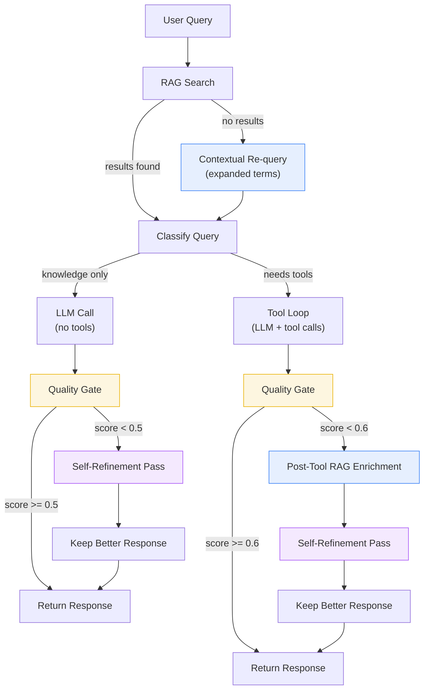

# AI Loopback Refinement

This document describes the loopback refinement mechanism in the AI Gateway agent loop. It improves response quality by iteratively enriching answers with additional RAG context and LLM self-refinement.

## Problem Statement

The original agent loop was **one-shot**: a single RAG search, a single LLM pass (or tool loop), and the response went directly to the user. This produced three categories of weak responses:

1. **Data without policy context** — Tool calls returned raw enrollment data (e.g., `status: PROCESSING`) but the LLM had no knowledge base context to explain what that status *means*, how long it takes, or what the employee should do next.

2. **Vague knowledge answers** — When the initial RAG search returned low-relevance chunks or no results, the LLM gave generic "I can help with benefits" responses instead of substantive answers.

3. **Incomplete blending** — Even when both data and knowledge were available, the LLM sometimes produced minimal responses that failed to combine them into actionable guidance.

## Architecture



## Three Refinement Mechanisms

### A. Contextual RAG Re-query

**When:** Initial RAG search returns no results and query doesn't require tools.

**What it does:** Prepends `"employee benefits"` to the user's query and retries the RAG search. This helps when the user's phrasing doesn't match the knowledge base vocabulary.

**Example:**
- User: "What's the deductible for the gold plan?"
- Initial RAG query: "What's the deductible for the gold plan?" → 0 results
- Expanded RAG query: "employee benefits What's the deductible for the gold plan?" → matches docs about plan deductibles

**Location in code:** `agent_loop.py`, in `run_agent_loop()`, before the knowledge path LLM call.

### B. Post-Tool RAG Enrichment

**When:** The tool-enabled agent loop completes and the response quality score is below threshold (< 0.6).

**What it does:**
1. Extracts key terms from tool results (status values, benefit types, plan names)
2. Builds a targeted RAG query (e.g., `"enrollment processing status how long does it take"`)
3. Fetches policy context from the knowledge base
4. Injects it as an additional system message
5. Asks the LLM to blend the data with the policy context

**Status Enrichment Map:**

| Tool Result Status | RAG Query Generated |
|---|---|
| `SUBMITTED` | "enrollment submitted status what happens next timeline" |
| `PROCESSING` | "enrollment processing status how long does it take" |
| `COMPLETED` | "enrollment completed status what to do next coverage start" |
| `DISPATCH_FAILED` | "enrollment dispatch failed error what to do retry" |

Benefit type selections (medical, dental, vision, life) also generate targeted queries for plan-specific policy context.

**Example:**
- User: "What's happening with Jane's enrollment?"
- Tool returns: `{employeeName: "Jane Doe", effectiveStatus: "PROCESSING", selections: [{type: "medical", plan: "gold"}]}`
- Without enrichment: "Jane Doe's enrollment is currently PROCESSING."
- With enrichment: RAG fetches processing timeline policy → "Jane Doe's enrollment is currently being processed. This typically takes 1-2 business days. You'll receive an email notification once her gold medical plan enrollment is complete."

**Location in code:** `agent_loop.py`, `_build_enrichment_query()` and `_refine_response()`.

### C. Response Quality Gate + Self-Refinement

**When:** After any LLM response (knowledge or tool-based), if the quality score is below threshold.

**What it does:**
1. Scores the response using heuristics (no LLM call)
2. If score is below threshold, appends the initial response to the conversation and adds a refinement instruction
3. Makes one additional LLM call asking for a more detailed answer
4. Compares the refined score to the original — keeps whichever is better

**Refinement instruction:**
> "Your previous answer could be more helpful. Please provide a more detailed and specific response. Include relevant plan names, timelines, next steps, or policy details where applicable."

**Location in code:** `agent_loop.py`, `_refine_response()`.

## Quality Scoring

**Function:** `_score_response(response, user_message) -> float`

Pure heuristic scoring (no LLM call), returns 0.0–1.0.

### Scoring Factors

| Factor | Effect | Weight |
|--------|--------|--------|
| Empty response | Score = 0.0 | Hard floor |
| Baseline | All responses start at | 0.50 |
| Too short (< `refinement_min_length` chars) for substantive question (5+ words) | Penalty | -0.30 |
| Long response (> 200 chars) | Bonus | +0.15 |
| Uncertainty phrases ("I'm not sure", "I don't know", "unclear", etc.) | Penalty per phrase | -0.15 each |
| Specificity indicators (dollar amounts, dates, plan names, percentages, benefit terms) | Bonus per indicator | +0.10 each (max +0.30) |

### Uncertainty Phrases Detected

- "i'm not sure", "i don't have", "i don't know", "i cannot"
- "i can't find", "i'm unable", "unclear", "no information"
- "not available", "i apologize", "unfortunately i"

### Specificity Patterns Detected

- Dollar amounts: `$500`, `$1,200`
- Dates: `11/01/2026`, `1-15-26`
- Plan tiers: gold, silver, bronze, platinum, basic
- Benefit types: medical, dental, vision, life
- Percentages: `80%`, `100%`
- Insurance terms: deductible, copay, premium, coinsurance, out-of-pocket

### Score Thresholds

| Path | Threshold | Action |
|------|-----------|--------|
| Knowledge (no tools) | < 0.5 | Trigger self-refinement |
| Tool-enabled | < 0.6 | Trigger RAG enrichment + self-refinement |

## Configuration

| Setting | Type | Default | Env Variable | Description |
|---------|------|---------|-------------|-------------|
| `enable_refinement` | bool | `True` | `ENABLE_REFINEMENT` | Master toggle for all refinement |
| `refinement_min_length` | int | `50` | `REFINEMENT_MIN_LENGTH` | Responses shorter than this (in chars) get a length penalty |
| `refinement_max_passes` | int | `1` | `REFINEMENT_MAX_PASSES` | Max refinement iterations |

Set `enable_refinement=False` to disable all loopback mechanisms and revert to one-shot behavior.

## Before / After Examples

### Example 1: Status Lookup

**Query:** "Check the status of enrollment for employee E12345"

**Before (one-shot):**
> E12345's enrollment status is PROCESSING.

**After (with loopback):**
> Employee **E12345** (Jane Doe) has a **gold medical plan** enrollment currently in **PROCESSING** status. This means your enrollment has been received and is being reviewed. Processing typically takes 1-2 business days. You'll receive a confirmation email once it's complete. Your coverage will be effective from the first of the following month.

### Example 2: Plan Comparison

**Query:** "What's the difference between gold and silver dental plans?"

**Before (one-shot, no RAG match):**
> I can help with dental plan information. Could you be more specific?

**After (with contextual re-query):**
> Here's a comparison of the dental plans:
>
> | Feature | Gold Dental | Silver Dental |
> |---------|-------------|---------------|
> | Annual Maximum | $2,000 | $1,500 |
> | Deductible | $50 | $75 |
> | Preventive | 100% | 100% |
> | Basic | 80% | 70% |
> | Major | 50% | 40% |
>
> The **Gold plan** is better if you anticipate major dental work. The **Silver plan** has a lower premium for basic coverage needs.

### Example 3: Vague Question

**Query:** "Tell me about my benefits"

**Before (one-shot):**
> You have access to benefits.

**After (quality gate triggers refinement):**
> As an employee, you have access to four benefit categories:
>
> - **Medical** — Gold, Silver, and Bronze plans with varying deductibles and coverage levels
> - **Dental** — Preventive care covered at 100%, basic and major services at reduced rates
> - **Vision** — Annual eye exams, lens and frame allowances
> - **Life** — Basic life insurance with optional supplemental coverage
>
> Would you like details on a specific plan, or shall I check your current enrollment status?

## Performance Impact

| Scenario | Extra Latency | Extra LLM Calls | Extra RAG Calls |
|----------|--------------|-----------------|-----------------|
| High-quality first response (score >= threshold) | 0 ms | 0 | 0 |
| Knowledge refinement triggered | +1-3 sec | +1 | 0 |
| Tool enrichment + refinement | +1-3 sec | +1 | +1 |
| Contextual RAG re-query (no initial results) | +0.5 sec | 0 | +1 |

The quality gate ensures refinement only fires for genuinely weak responses. In practice, most well-formed questions produce adequate first-pass answers and skip refinement entirely.

## Audit Trail

Refinement events are logged to the audit log:

```json
{
  "timestamp": "2026-03-18T05:15:04.000Z",
  "event": "response_refined",
  "original_score": 0.35,
  "refined_score": 0.80,
  "original_length": 42,
  "refined_length": 312
}
```

This enables monitoring of refinement frequency and effectiveness over time.

## Implementation Files

| File | What Changed |
|------|-------------|
| `services/ai-platform/ai-gateway/src/services/agent_loop.py` | Added `_score_response()`, `_build_enrichment_query()`, `_refine_response()`, contextual re-query logic, quality gates in both knowledge and tool paths |
| `services/ai-platform/ai-gateway/config/settings.py` | Added `enable_refinement`, `refinement_min_length`, `refinement_max_passes` |
