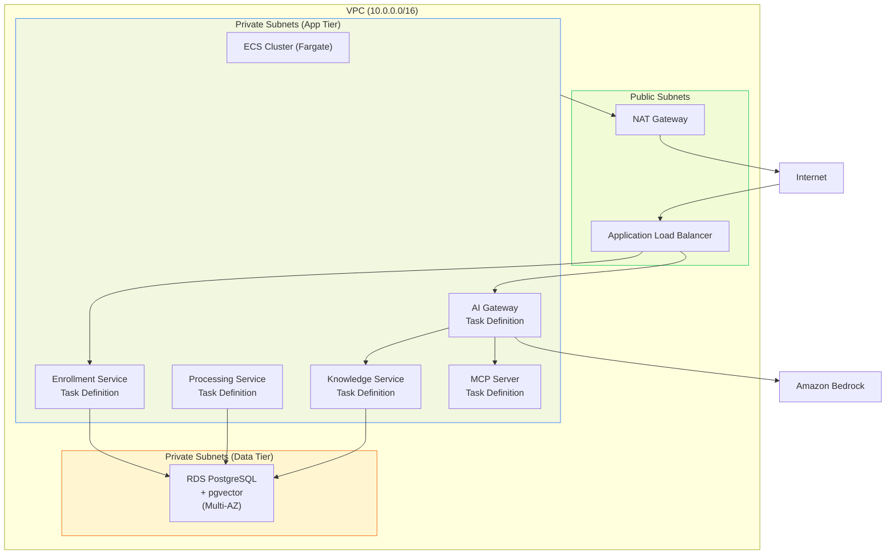
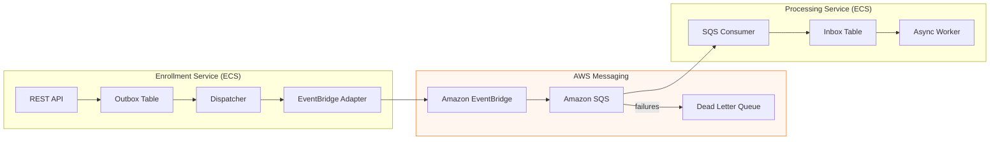
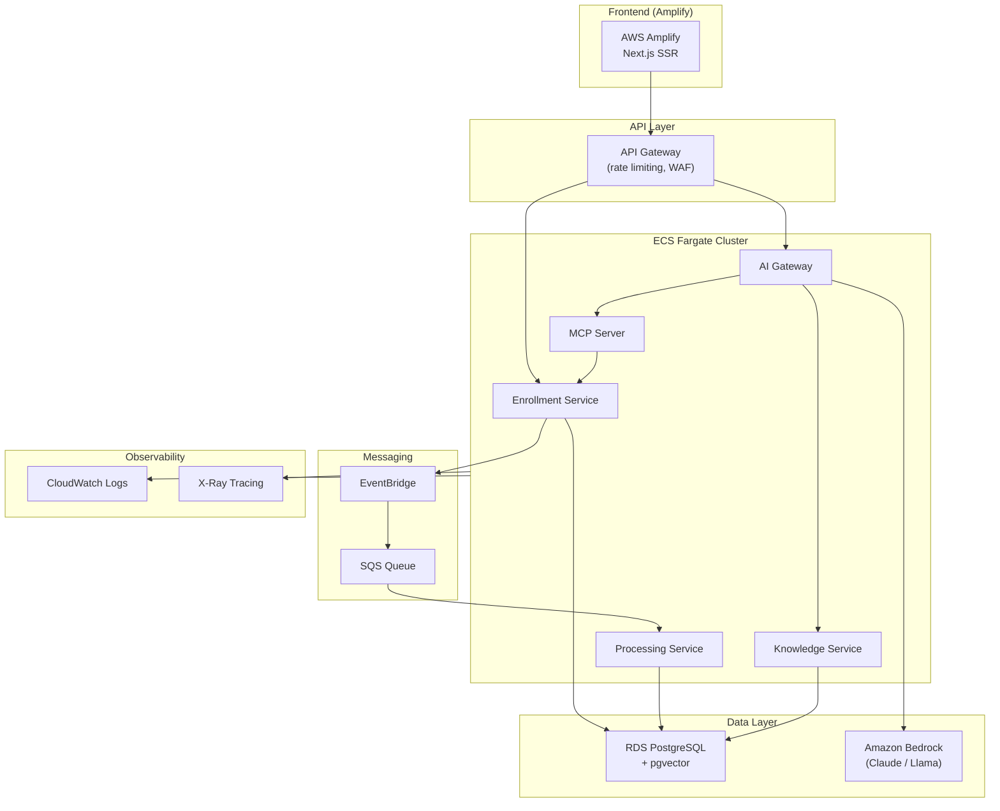

# AWS Architecture

This document describes the target AWS architecture for the Employee Benefits Platform, mapping each local component to its AWS equivalent.

## Local to AWS Mapping

| Local Component | AWS Service | Notes |
|----------------|-------------|-------|
| PostgreSQL 16 (Docker) | Amazon RDS PostgreSQL + pgvector | Multi-AZ, automated backups, private subnet |
| Enrollment Service | ECS Fargate | Auto-scaling, ALB health checks |
| Processing Service | ECS Fargate | Event-driven scaling from SQS |
| HTTP Publisher Adapter | EventBridge Publisher Adapter | Config swap: `PUBLISHER_TRANSPORT=eventbridge` |
| Direct HTTP delivery | EventBridge → SQS → Processing | Decoupled, durable, with DLQ |
| AI Gateway | ECS Fargate + ALB | Behind API Gateway for rate limiting |
| Knowledge Service | ECS Fargate | Uses pgvector on same RDS instance |
| MCP Server | ECS Fargate | SSE transport, internal only |
| Ollama (local LLM) | Amazon Bedrock | Managed LLM, no GPU infrastructure |
| Next.js Frontend | AWS Amplify | CDN-backed, auto-deploy from Git |
| Flyway migrations | Same (runs on ECS task startup) | Connects to RDS |
| audit.log (file) | CloudWatch Logs | Structured JSON via awslogs driver |
| Rate limiter (in-memory) | API Gateway throttling + WAF | Distributed rate limiting |
| Docker Compose | ECS + ECR | Container registry + orchestration |

## VPC Architecture

## Event-Driven Flow

### What Changes from Local

The only code change is a new `EventBridgeEnrollmentEventPublisher` adapter (implementing the existing `EnrollmentEventPublisher` interface) and setting `PUBLISHER_TRANSPORT=eventbridge`. The enrollment API, data model, and processing logic are untouched.

The Processing Service gains an SQS consumer that replaces the HTTP endpoint — receiving events from the SQS queue instead of direct HTTP POST.

## Service Architecture

## Infrastructure Components

### Networking
- **VPC** with 2 Availability Zones
- **Public subnets** — ALB, NAT Gateway
- **Private subnets (app)** — ECS Fargate tasks
- **Private subnets (data)** — RDS instance
- **Security groups** — ALB → ECS (8080/8200), ECS → RDS (5432), ECS → ECS (internal)

### Compute (ECS Fargate)
- **Cluster** — single ECS cluster for all services
- **Services** — one ECS service per microservice with desired count and auto-scaling
- **Task definitions** — CPU/memory allocations, environment variables from Parameter Store
- **ECR** — one repository per service for Docker images

### Database (RDS)
- **Engine** — PostgreSQL 16 with pgvector extension
- **Instance** — db.t3.medium (dev), db.r6g.large (prod)
- **Multi-AZ** — for production availability
- **Flyway** — migrations run on ECS task startup

### Messaging
- **EventBridge** — custom event bus for enrollment events
- **SQS** — standard queue with DLQ (maxReceiveCount: 3)
- **EventBridge Rule** — routes `EnrollmentSubmitted` events to SQS

### AI Platform
- **Amazon Bedrock** — replaces Ollama; switch `OLLAMA_BASE_URL` → Bedrock endpoint
- **RDS pgvector** — same database for embedding storage and vector search
- **API Gateway** — WAF + throttling replaces in-memory rate limiter

### Observability
- **CloudWatch Logs** — structured JSON via ECS awslogs driver
- **CloudWatch Metrics** — ECS service metrics, custom enrollment metrics
- **X-Ray** — distributed tracing across services

### Security
- **IAM roles** — least privilege per ECS task
- **Secrets Manager** — database credentials, API keys
- **Parameter Store** — non-secret configuration
- **WAF** — API Gateway protection (rate limiting, geo-blocking)
- **VPC endpoints** — private connectivity to AWS services

## Cost Estimate (Development)

| Component | Monthly Cost (est.) |
|-----------|-------------------|
| RDS db.t3.medium (Multi-AZ) | ~$70 |
| ECS Fargate (5 services, minimal) | ~$50 |
| NAT Gateway | ~$35 |
| ALB | ~$20 |
| SQS + EventBridge | ~$1 |
| ECR | ~$1 |
| Bedrock (Claude Haiku, light usage) | ~$10 |
| **Total** | **~$190/month** |

## Deployment Strategy

1. **CI/CD** — GitHub Actions builds Docker images, pushes to ECR, triggers ECS deployment
2. **Blue/Green** — ECS rolling deployment with health check grace period
3. **Database migrations** — run as one-off ECS task before service deployment
4. **Feature flags** — `PUBLISHER_TRANSPORT` env var controls HTTP vs EventBridge

## Infrastructure as Code

Both CloudFormation and Terraform templates are provided:

- CloudFormation: [infrastructure/cloudformation/template.yaml](../infrastructure/cloudformation/template.yaml)
- Terraform: [infrastructure/terraform/](../infrastructure/terraform/)

These are deployment-ready scaffolds with parameterized values. Customize the parameters for your AWS account and deploy.
