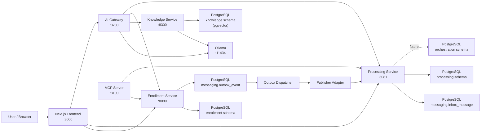
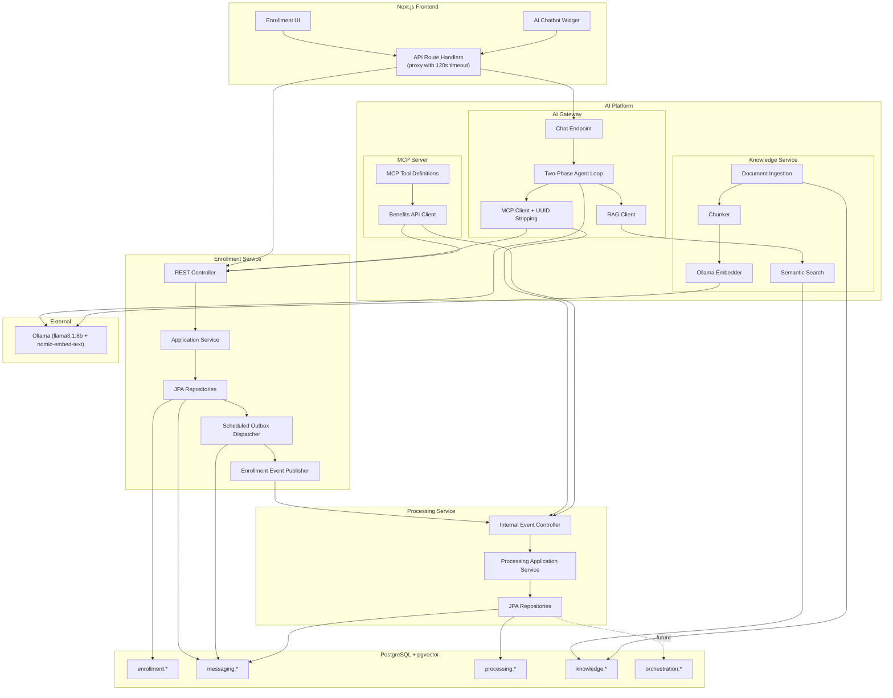
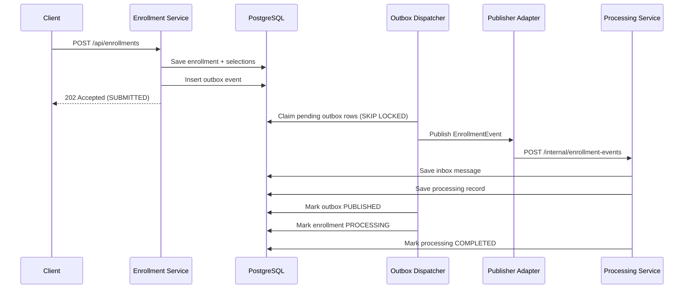
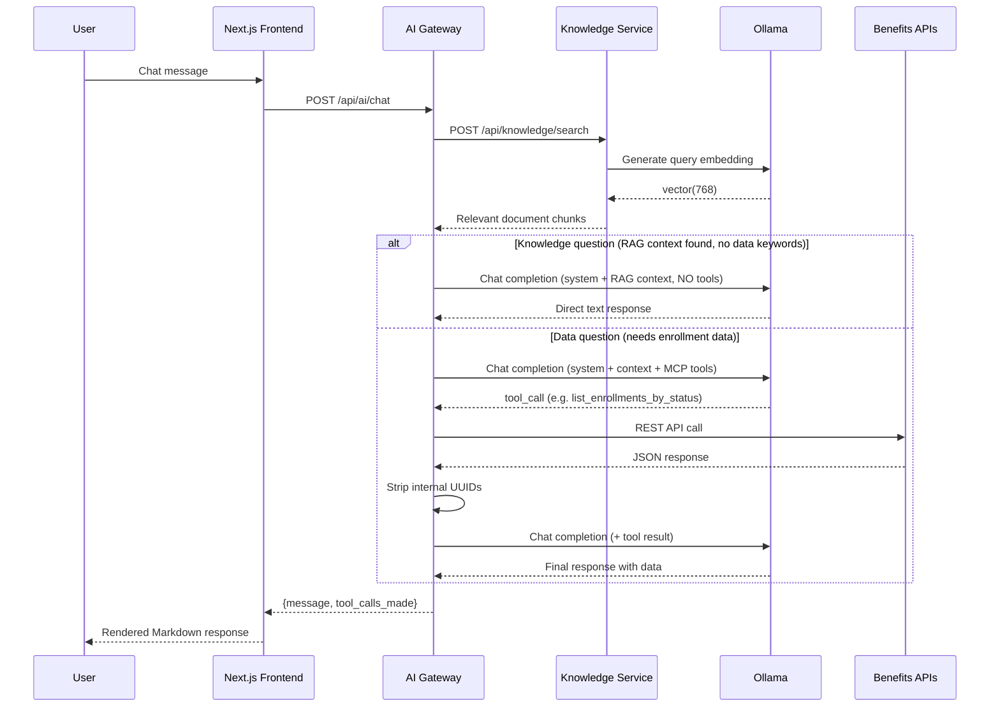
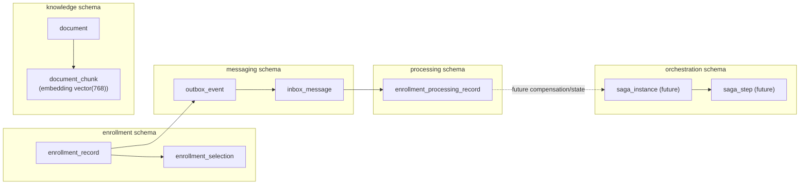
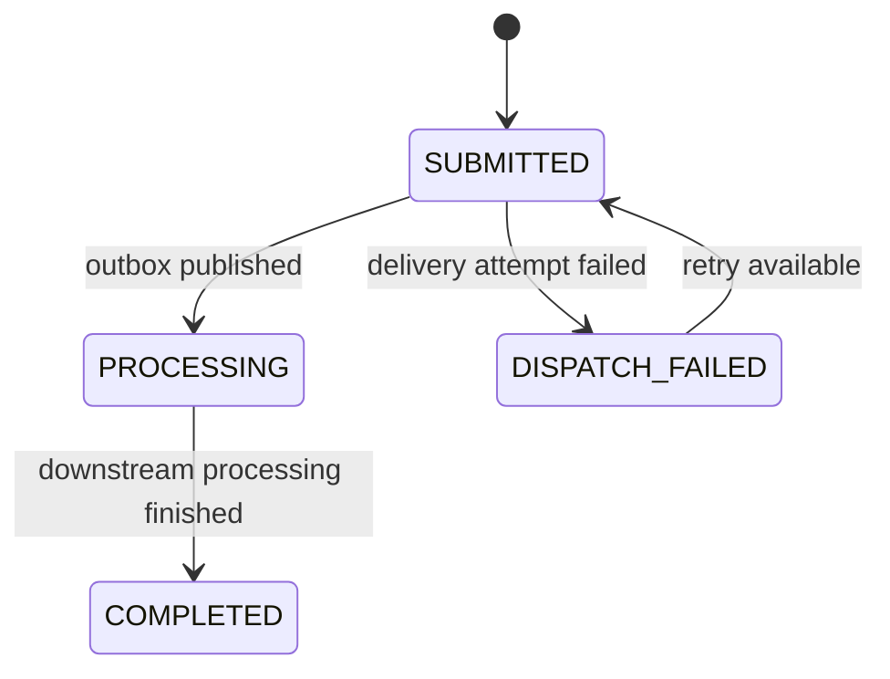
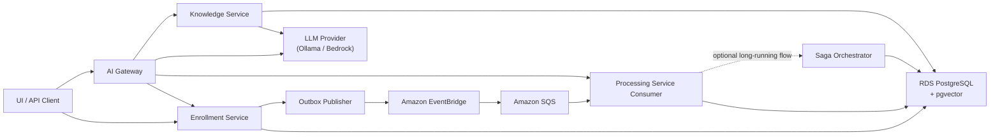

# System Architecture

This document describes the platform architecture and the target cloud evolution path.

## Overview

The platform accepts employee benefit enrollment requests, persists them in a domain-oriented PostgreSQL data model, and drives downstream processing through a durable outbox/inbox messaging pattern. The current implementation uses a transport-specific publisher adapter for local HTTP delivery, and that boundary is designed to evolve toward EventBridge, SQS, and saga orchestration without breaking the external enrollment API.

An **AI Platform** layer provides natural language access to the enrollment pipeline through an AI chatbot. It uses a local LLM (Ollama), MCP tools wrapping the benefits APIs, and a RAG knowledge base for benefits policy documents. A **Next.js Frontend** serves the enrollment UI and embeds the AI chatbot widget.

## Context Diagram

## Runtime Component View

## Runtime Sequence

## AI Chat Sequence

## Data Ownership Diagram

## State Transitions

## Service Responsibilities

### Next.js Frontend (:3000)

- enrollment submission UI and status dashboard
- AI chatbot floating widget with markdown rendering (react-markdown + remark-gfm)
- API route handlers proxying to AI Gateway with 120s timeout for LLM latency
- rewrites proxying to Enrollment (:8080) and Processing (:8081) services
- graceful degradation when AI Gateway is unavailable

### Enrollment Service (:8080)

- owns enrollment submission and status lookup APIs
- writes `enrollment.enrollment_record` and `enrollment.enrollment_selection`
- writes `messaging.outbox_event`
- runs the outbox dispatcher and retry loop
- chooses a transport-specific publisher adapter from configuration

### Processing Service (:8081)

- accepts internal enrollment events
- enforces idempotency through `messaging.inbox_message`
- writes `processing.enrollment_processing_record`
- performs asynchronous completion updates

### MCP Server (:8100)

- exposes benefits APIs as MCP-compatible tools (8 tools: submit, get, list, check status)
- provides MCP resources and prompt templates for AI clients
- SSE transport for remote MCP clients (Claude Desktop, Claude Code)
- stateless — no database, no LLM calls

### AI Gateway (:8200)

- orchestrates LLM calls (Ollama) with MCP tool execution
- two-phase agent loop: classifies queries as knowledge vs. data, routes accordingly
- RAG augmentation: injects Knowledge Service context into LLM prompts
- tool result post-processing: strips internal UUIDs before LLM sees them
- conversation management with session-based message history
- calls benefits APIs directly (via `_benefits_proxy`) rather than going through MCP SSE transport

### Knowledge Service (:8300)

- document ingestion with chunking (512 tokens, 50 token overlap)
- embedding generation via Ollama (`nomic-embed-text`, 768-dim vectors)
- semantic search with cosine similarity over pgvector
- category-based filtering (policy, plan, faq, compliance, process)
- reads/writes `knowledge.document` and `knowledge.document_chunk`

## Database Boundaries

### `enrollment`

- canonical enrollment request state
- benefit plan selections for each request

### `processing`

- downstream execution state for the enrollment lifecycle

### `messaging`

- outbox rows for durable publish
- inbox rows for idempotent consume
- claim metadata to support multiple dispatcher instances safely

### `knowledge`

- document metadata and content
- document chunks with vector embeddings (pgvector `vector(768)`)
- cosine similarity index (`ivfflat`) for semantic search

### `orchestration`

- reserved for future saga coordinators and compensating steps

## Outbox Hardening

The dispatcher supports safe multi-instance behavior:

- rows are claimed through `FOR UPDATE SKIP LOCKED`
- claims expire after a configured TTL
- delivery attempts are counted
- the last delivery error is stored for debugging
- failed rows are retried after a backoff delay

## Target Cloud Evolution

The current dispatcher publishes through an adapter boundary. The next cloud step is to replace the transport, not the ownership model:

1. Enrollment Service writes the outbox row.
2. An outbox publisher adapter emits to EventBridge.
3. EventBridge routes to SQS.
4. Processing Service consumes from SQS and still writes inbox + processing state.
5. A saga orchestrator can later persist long-running workflow state in the `orchestration` schema.

## Cloud Evolution Diagram

## Port Allocation

| Port | Service |
|------|---------|
| 3000 | Next.js Frontend |
| 8080 | Enrollment Service |
| 8081 | Processing Service |
| 8100 | MCP Server |
| 8200 | AI Gateway |
| 8300 | Knowledge Service |
| 11434 | Ollama |
| 55432 | PostgreSQL + pgvector |
