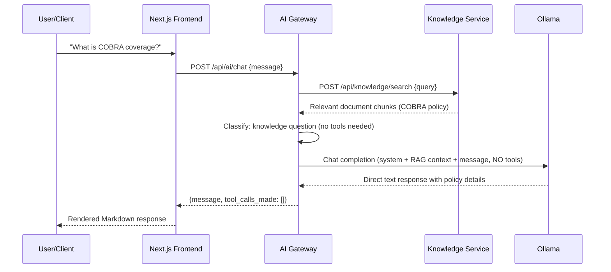
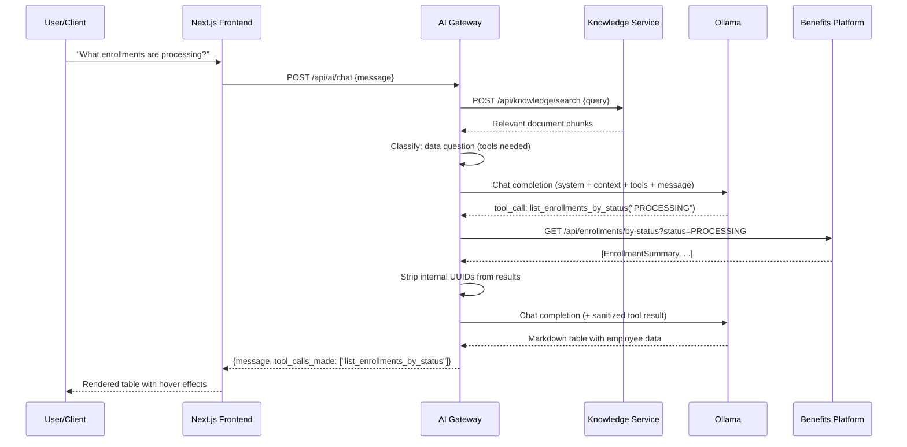
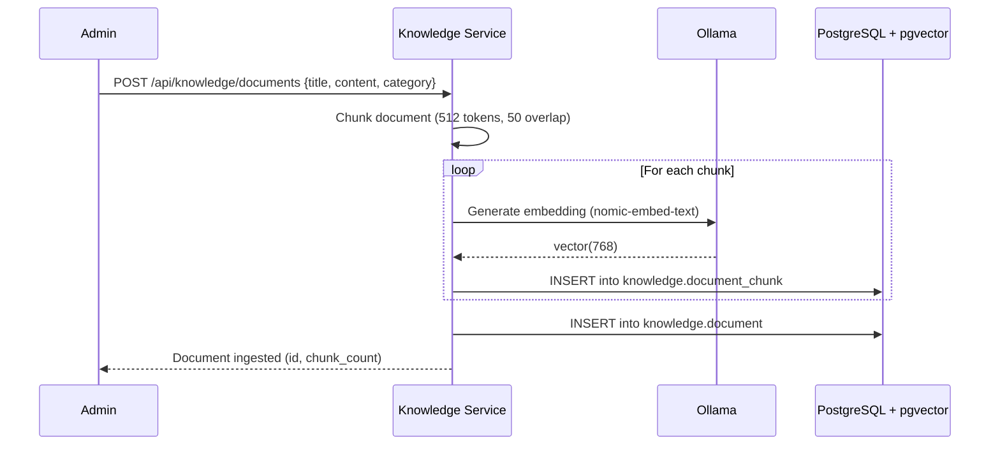
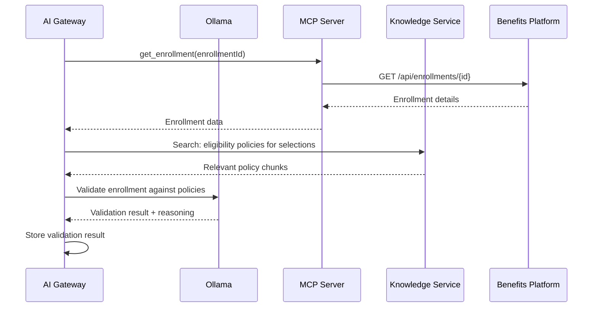

# AI Platform Architecture & Design

This document defines the architecture, technology choices, and design rationale for the AI Platform — a suite of services that adds intelligent automation, natural language interaction, and context-aware decision making to the Employee Benefits Event Processing Platform.

## Table of Contents

1. [Vision & Goals](#vision--goals)
2. [Architecture Overview](#architecture-overview)
3. [Technology Choices](#technology-choices)
4. [Service Descriptions](#service-descriptions)
5. [MCP Server](#mcp-server)
6. [AI Gateway](#ai-gateway)
7. [Knowledge Service (RAG)](#knowledge-service-rag)
8. [Agentic Workflows](#agentic-workflows)
9. [Data Flow Diagrams](#data-flow-diagrams)
10. [Deployment Architecture](#deployment-architecture)
11. [Security Considerations](#security-considerations)
12. [Roadmap](#roadmap)

---

## Vision & Goals

The AI Platform enhances the existing benefits enrollment pipeline with:

- **Natural language access** to enrollment APIs via MCP tooling, enabling AI assistants to submit, query, and manage enrollments through conversational interfaces.
- **Intelligent processing** that uses AI agents to validate enrollments, advise on plan selections, check compliance, and auto-resolve common issues.
- **Context-aware decisions** powered by a RAG (Retrieval-Augmented Generation) knowledge base containing benefits policies, eligibility rules, plan documents, and historical patterns.
- **Loose coupling** — the AI Platform is a standalone service layer that communicates with the benefits platform exclusively through its public REST APIs. It can be extended to serve other services without modifying the core enrollment pipeline.

### Non-Goals

- Replacing human decision-making for high-stakes enrollment changes (AI assists, humans approve).
- Modifying the core enrollment or processing services — the AI Platform is an overlay, not a fork.
- Requiring cloud-hosted LLM APIs — all inference runs locally via Ollama.

---

## Architecture Overview

```
┌─────────────────────────────────────────────────────────────────────┐
│                         AI Platform                                 │
│                                                                     │
│  ┌──────────────┐   ┌──────────────────┐   ┌────────────────────┐  │
│  │  MCP Server   │   │   AI Gateway     │   │ Knowledge Service  │  │
│  │  (port 8100)  │   │   (port 8200)    │   │   (port 8300)      │  │
│  │               │   │                  │   │                    │  │
│  │  Tool defs    │   │  Ollama client   │   │  Document ingest   │  │
│  │  wrapping     │◄──│  Agent loops     │──▶│  Embeddings        │  │
│  │  benefits     │   │  Conversation    │   │  Vector search     │  │
│  │  REST APIs    │   │  management      │   │  pgvector store    │  │
│  └──────┬───────┘   └────────┬─────────┘   └─────────┬──────────┘  │
│         │                    │                        │             │
└─────────┼────────────────────┼────────────────────────┼─────────────┘
          │                    │                        │
          ▼                    ▼                        ▼
┌──────────────────┐   ┌──────────────┐   ┌──────────────────────┐
│ Benefits Platform │   │   Ollama     │   │    PostgreSQL        │
│ Enrollment :8080  │   │   :11434     │   │    + pgvector        │
│ Processing :8081  │   │  (local LLM) │   │    knowledge schema  │
└──────────────────┘   └──────────────┘   └──────────────────────┘
```

### Key Architectural Principles

1. **API-only integration** — The AI Platform never accesses the benefits database directly. All interaction goes through the published REST endpoints on ports 8080 and 8081.
2. **Ollama as the LLM engine** — All inference (chat completions, embeddings) runs locally through Ollama. No external API keys required. No data leaves the local environment.
3. **MCP as the tool contract** — The MCP Server defines a standard tool interface that any MCP-compatible client (Claude Desktop, Claude Code, custom agents) can consume. The AI Gateway uses these same tool definitions internally.
4. **Stateless services, stateful knowledge** — The MCP Server and AI Gateway are stateless request handlers. Only the Knowledge Service maintains persistent state (document embeddings in pgvector).

---

## Technology Choices

### Python + FastAPI (all three services)

| Factor | Decision | Rationale |
|--------|----------|-----------|
| **Language** | Python 3.11+ | The AI/ML ecosystem is Python-first. Ollama SDK, MCP SDK, embedding pipelines, vector search libraries, and agent frameworks all have Python as primary target. |
| **Framework** | FastAPI | Async-native, automatic OpenAPI docs, Pydantic validation, high performance via uvicorn. Matches the ergonomics needed for LLM streaming and concurrent tool calls. |
| **Why not Spring Boot** | Considered and rejected | The existing benefits services are Java/Spring Boot, but the AI Platform is a separate concern. Spring AI exists but is immature. Java requires 3-5x more boilerplate for equivalent AI functionality. LLM response latency (1-5s) dominates — Java's throughput advantage is irrelevant here. |
| **Why not TypeScript** | Considered | MCP TypeScript SDK is mature, but Python's AI ecosystem (LangChain, pgvector, Ollama SDK) is broader. Keeping one language across all three AI services reduces complexity. |

### Ollama (LLM & Embeddings)

| Factor | Decision | Rationale |
|--------|----------|-----------|
| **LLM engine** | Ollama (local) | Free, private, no API keys. Runs models locally on CPU/GPU. Supports tool calling with compatible models. |
| **Chat model** | `llama3.1:8b` | Already installed. Supports tool/function calling. Good balance of capability and speed for 8B parameter model. |
| **Embedding model** | `nomic-embed-text` | High-quality 768-dim embeddings, optimized for retrieval. Small footprint, fast inference. Will be pulled as part of setup. |
| **Why not Claude API** | No API key available | User constraint. Ollama provides equivalent local capability for this use case. Architecture can be extended to support cloud LLMs later via a provider abstraction. |

### PostgreSQL + pgvector (Knowledge Store)

| Factor | Decision | Rationale |
|--------|----------|-----------|
| **Vector store** | pgvector extension in existing PostgreSQL | No new infrastructure. The benefits platform already runs PostgreSQL 16. Adding pgvector keeps everything in one database with a dedicated `knowledge` schema. |
| **Why not a dedicated vector DB** | Unnecessary complexity | Pinecone, Weaviate, Chroma add operational overhead. pgvector handles the scale of a benefits knowledge base (thousands of documents, not millions) with excellent performance. |
| **Schema isolation** | `knowledge` schema | Follows the existing pattern of logical schema separation (`enrollment`, `processing`, `messaging`, `orchestration`, now `knowledge`). |

### MCP (Model Context Protocol)

| Factor | Decision | Rationale |
|--------|----------|-----------|
| **Protocol** | MCP (Anthropic standard) | Open protocol for exposing tools, resources, and prompts to AI models. Supported by Claude Desktop, Claude Code, and growing ecosystem. |
| **SDK** | `mcp` Python package | Official Anthropic SDK. Well-maintained, supports both stdio and SSE transports. |
| **Role** | Tool provider only | MCP Server wraps benefits APIs as tools. It does NOT control Ollama or make LLM calls. The AI Gateway is the orchestrator that calls Ollama and invokes MCP tools. |

### Project Dependencies Summary

```
mcp-server/
├── fastapi, uvicorn          # HTTP server
├── mcp                       # MCP SDK (tool definitions, SSE transport)
├── httpx                     # Async HTTP client (calls benefits APIs)
└── pydantic                  # Request/response validation

ai-gateway/
├── fastapi, uvicorn          # HTTP server
├── ollama                    # Ollama Python SDK
├── httpx                     # Calls MCP server + benefits APIs
├── pydantic                  # Validation
└── sse-starlette             # Server-sent events for streaming

knowledge-service/
├── fastapi, uvicorn          # HTTP server
├── ollama                    # Embedding generation
├── asyncpg                   # Async PostgreSQL driver
├── pgvector                  # pgvector Python bindings
├── sqlalchemy[asyncio]       # Async ORM for document/chunk management
├── pydantic                  # Validation
└── python-multipart          # File upload support
```

---

## Service Descriptions

### MCP Server (port 8100)

**Purpose**: Wraps the Employee Benefits Platform REST APIs as MCP-compatible tools, resources, and prompts. Any MCP client can discover and invoke these tools to interact with the enrollment pipeline.

**What it is NOT**: The MCP Server is not an LLM. It does not call Ollama. It is a tool definition and execution layer — a bridge between AI agents and the benefits APIs.

#### Tools

| Tool Name | Maps To | Description |
|-----------|---------|-------------|
| `submit_enrollment` | `POST /api/enrollments` | Submit a new benefits enrollment |
| `get_enrollment` | `GET /api/enrollments/{id}` | Retrieve enrollment by ID |
| `get_enrollment_by_employee` | `GET /api/enrollments/by-employee/{id}` | Retrieve enrollment by employee ID |
| `get_enrollment_by_name` | `GET /api/enrollments/by-name/{name}` | Retrieve enrollment by employee name |
| `list_enrollments_by_status` | `GET /api/enrollments/by-status?status=` | List all enrollments with a given status |
| `get_processing_details` | `GET /api/processed-enrollments/{id}` | Get processing record for an enrollment |
| `get_processing_by_employee` | `GET /api/processed-enrollments/by-employee/{id}` | Get processing record by employee ID |
| `check_enrollment_status` | Combined: enrollment + processing lookup | Get full status with effective state derivation |

#### Resources

| Resource URI | Description |
|-------------|-------------|
| `benefits://enrollment/{enrollmentId}` | Full enrollment record as a structured resource |
| `benefits://employee/{employeeId}/enrollment` | Latest enrollment for an employee |
| `benefits://status-summary` | Aggregate counts by enrollment status |

#### Prompts

| Prompt Name | Description |
|-------------|-------------|
| `enrollment-assistant` | System prompt for a benefits enrollment help agent |
| `status-checker` | Prompt template for checking and explaining enrollment status |
| `benefits-advisor` | Prompt template for recommending benefit plan selections |

### AI Gateway (port 8200)

**Purpose**: The orchestration layer that connects users (via chat API), Ollama (for LLM inference), MCP tools (for enrollment actions), and the Knowledge Service (for RAG context). This is the "brain" of the AI Platform.

#### Responsibilities

- **Conversation management** — Maintains chat sessions with message history.
- **LLM orchestration** — Sends prompts to Ollama with tool definitions, processes tool call responses, executes tools via MCP Server, and feeds results back to the LLM.
- **RAG augmentation** — Before answering, queries the Knowledge Service for relevant context (policies, plan details, eligibility rules) and injects it into the LLM prompt.
- **Agent workflows** — Implements multi-step agent loops for complex tasks (enrollment validation, benefits advising, compliance checking).
- **Streaming responses** — Supports SSE streaming for real-time chat responses.

#### Endpoints

| Method | Endpoint | Description |
|--------|----------|-------------|
| POST | `/api/ai/chat` | Send a message, get AI response (supports streaming via SSE) |
| GET | `/api/ai/conversations/{id}` | Retrieve conversation history |
| DELETE | `/api/ai/conversations/{id}` | Clear a conversation |
| POST | `/api/ai/agents/validate` | Run enrollment validation agent |
| POST | `/api/ai/agents/advise` | Run benefits advisor agent |
| GET | `/api/ai/health` | Health check (includes Ollama connectivity) |

#### Agent Loop Architecture (Two-Phase)

The AI Gateway uses a **two-phase routing strategy** to optimize response quality with smaller local models (llama3.1:8b):

```
User message
    │
    ▼
┌─────────────────────────────────────────────┐
│  1. Retrieve RAG context from Knowledge Svc │
│  2. Classify query: knowledge vs. data      │
│     ┌──────────────┬──────────────────────┐  │
│     │  Knowledge Q  │  Data/Action Q       │  │
│     │  (has RAG     │  (needs enrollment   │  │
│     │   context)    │   data or tools)     │  │
│     └──────┬───────┴──────────┬───────────┘  │
│            ▼                  ▼               │
│     Single LLM call     Tool-enabled loop    │
│     (no tools passed)   (with MCP tools)     │
│            │            ┌─────────────┐      │
│            │            │ Send to LLM │◄─┐   │
│            │            │ w/ tools    │  │   │
│            │            │ Execute     │  │   │
│            │            │ tool calls  │──┘   │
│            │            └─────────────┘      │
│            ▼                  ▼               │
│         Return final text response            │
└─────────────────────────────────────────────┘
```

**Why two phases?** Smaller LLMs (8B params) are heavily biased toward tool calling when tools are present in the request — even for questions fully answerable from RAG context. By only passing tools when the query actually needs enrollment data, knowledge questions get clean, context-rich answers without spurious tool invocations.

**Query classification** uses keyword matching against enrollment-related terms (`status`, `enrollment`, `employee id`, `submit`, etc.). If RAG context is available and no data keywords are found, the query is routed to the knowledge path.

The tool-enabled loop runs up to a configurable max iterations (default 10) to prevent infinite tool-call cycles.

#### Tool Result Post-Processing

Tool results are sanitized before reaching the LLM:
- **UUID stripping** — Internal enrollment UUIDs (`enrollmentId`, `processedEnrollmentId`) are removed from tool results since they are meaningless to end users.
- The LLM sees only user-relevant fields: Employee Name, Employee ID, Status, Benefit Type, and dates.

### Knowledge Service (port 8300)

**Purpose**: Manages the RAG (Retrieval-Augmented Generation) knowledge base. Ingests documents, generates embeddings via Ollama, stores them in pgvector, and provides semantic search for context retrieval.

#### Responsibilities

- **Document ingestion** — Accept text, PDF, or markdown documents with metadata and category tags.
- **Chunking** — Split documents into overlapping chunks optimized for retrieval (default 512 tokens, 50 token overlap).
- **Embedding generation** — Generate vector embeddings via Ollama's `nomic-embed-text` model.
- **Vector storage** — Persist chunks and embeddings in PostgreSQL with pgvector.
- **Semantic search** — Find relevant chunks by cosine similarity to a query embedding.
- **Category filtering** — Filter search results by knowledge category (policy, plan, faq, compliance).

#### Endpoints

| Method | Endpoint | Description |
|--------|----------|-------------|
| POST | `/api/knowledge/documents` | Ingest a new document |
| GET | `/api/knowledge/documents` | List all documents |
| GET | `/api/knowledge/documents/{id}` | Get document details |
| DELETE | `/api/knowledge/documents/{id}` | Remove a document and its chunks |
| POST | `/api/knowledge/search` | Semantic search across knowledge base |
| GET | `/api/knowledge/categories` | List knowledge categories |
| GET | `/api/knowledge/health` | Health check (includes pgvector + Ollama status) |

#### Knowledge Categories

| Category | Content Examples |
|----------|-----------------|
| `policy` | Enrollment eligibility rules, open enrollment windows, life event triggers |
| `plan` | Medical/dental/vision/life plan details, coverage tiers, premiums |
| `faq` | Common questions and answers about benefits enrollment |
| `compliance` | Regulatory requirements, HIPAA considerations, ACA mandates |
| `process` | Internal processing rules, approval workflows, escalation criteria |

#### Database Schema (pgvector)

```sql
CREATE SCHEMA IF NOT EXISTS knowledge;

CREATE TABLE knowledge.document (
    document_id     UUID PRIMARY KEY DEFAULT gen_random_uuid(),
    title           TEXT NOT NULL,
    source          TEXT,
    category        TEXT NOT NULL,
    content         TEXT NOT NULL,
    metadata        JSONB DEFAULT '{}',
    created_at      TIMESTAMPTZ NOT NULL DEFAULT now(),
    updated_at      TIMESTAMPTZ NOT NULL DEFAULT now()
);

CREATE TABLE knowledge.document_chunk (
    chunk_id        UUID PRIMARY KEY DEFAULT gen_random_uuid(),
    document_id     UUID NOT NULL REFERENCES knowledge.document(document_id) ON DELETE CASCADE,
    chunk_index     INTEGER NOT NULL,
    content         TEXT NOT NULL,
    token_count     INTEGER NOT NULL,
    embedding       vector(768),  -- nomic-embed-text produces 768-dim vectors
    created_at      TIMESTAMPTZ NOT NULL DEFAULT now()
);

CREATE INDEX idx_chunk_embedding ON knowledge.document_chunk
    USING ivfflat (embedding vector_cosine_ops) WITH (lists = 100);

CREATE INDEX idx_chunk_document ON knowledge.document_chunk(document_id);

CREATE INDEX idx_document_category ON knowledge.document(category);
```

---

## Agentic Workflows

The AI Gateway implements agent workflows that complement the existing enrollment orchestration. These agents use the tool-call loop pattern: the LLM reasons about the task, invokes MCP tools to gather data or perform actions, and iterates until the task is complete.

### Enrollment Validation Agent

**Trigger**: Called when a new enrollment is submitted or on-demand via the AI Gateway.

**Flow**:
1. Retrieve enrollment details via `get_enrollment` tool.
2. Query Knowledge Service for eligibility policies relevant to the employee's selections.
3. LLM evaluates selections against retrieved policies.
4. Returns validation result: `APPROVED`, `NEEDS_REVIEW`, or `REJECTED` with reasoning.

### Benefits Advisor Agent

**Trigger**: User asks "What benefits should I choose?" or similar.

**Flow**:
1. Gather employee context (existing enrollment, employee ID).
2. Query Knowledge Service for plan details, coverage tiers, and comparison data.
3. LLM analyzes options and provides personalized recommendation with reasoning.

### Status Resolution Agent

**Trigger**: User asks about a stuck or failed enrollment.

**Flow**:
1. Check enrollment status via `check_enrollment_status` tool.
2. If `DISPATCH_FAILED`, query Knowledge Service for known resolution patterns.
3. LLM provides explanation and suggested next steps.

### Compliance Check Agent

**Trigger**: Periodic or on-demand compliance review.

**Flow**:
1. List enrollments by status via `list_enrollments_by_status` tool.
2. For each enrollment, retrieve details and check against compliance rules from Knowledge Service.
3. Flag any enrollments that may not meet regulatory requirements.

---

## Data Flow Diagrams

### Chat Interaction Flow (Knowledge Question)



### Chat Interaction Flow (Enrollment Data Question)



### Document Ingestion Flow



### Agentic Validation Flow



---

## Deployment Architecture

### Local Development

All three AI services run locally alongside the existing benefits platform:

```
Port Allocation:
  8080  — Enrollment Service (existing)
  8081  — Processing Service (existing)
  8100  — MCP Server (new)
  8200  — AI Gateway (new)
  8300  — Knowledge Service (new)
  11434 — Ollama (existing)
  55432 — PostgreSQL with pgvector (existing, port may vary)
  3000  — Frontend with AI chatbot (existing)
```

### Docker Compose

The root `infrastructure/docker-compose.yml` uses the `pgvector/pgvector:pg16` image (instead of vanilla `postgres:16`) to provide the pgvector extension needed by the Knowledge Service. This is a drop-in replacement that adds vector similarity search support.

The AI Platform also has its own `docker-compose.yml` for containerized deployment:

```yaml
# services/ai-platform/infrastructure/docker-compose.yml
# Builds all three Python services as containers
# Uses host.docker.internal to reach Ollama and benefits APIs
```

### Ollama Model Requirements

```bash
# Required models (pulled during setup)
ollama pull llama3.1:8b           # Chat/reasoning (already installed)
ollama pull nomic-embed-text      # Embeddings for RAG
```

---

## Security Considerations

- **No external API calls** — All LLM inference is local via Ollama. No enrollment data leaves the environment.
- **API-only access** — The AI Platform never touches the benefits database directly. All data access goes through the published REST APIs.
- **No PII in embeddings** — The Knowledge Service stores policy documents, plan details, and FAQ content — not employee PII. Enrollment data is fetched on-demand via MCP tools and not persisted in the knowledge store.
- **Audit trail** — The AI Gateway logs all tool invocations and agent decisions for traceability.
- **Rate limiting** — The AI Gateway enforces rate limits on chat and agent endpoints to prevent abuse.

---

## Project Structure

```
services/ai-platform/
├── docs/
│   └── architecture.md          # This document
├── infrastructure/
│   └── docker-compose.yml       # Docker Compose for AI services
├── scripts/
│   ├── setup.sh                 # Install dependencies, pull models
│   └── run-local.sh             # Start all three services
├── mcp-server/
│   ├── src/
│   │   ├── main.py              # FastAPI app + MCP server setup
│   │   ├── tools.py             # MCP tool definitions
│   │   ├── resources.py         # MCP resource definitions
│   │   ├── prompts.py           # MCP prompt templates
│   │   └── benefits_client.py   # HTTP client for benefits APIs
│   ├── config/
│   │   └── settings.py          # Configuration (URLs, ports)
│   ├── tests/
│   ├── requirements.txt
│   └── Dockerfile
├── ai-gateway/
│   ├── src/
│   │   ├── main.py              # FastAPI app
│   │   ├── routes/
│   │   │   ├── chat.py          # Chat endpoints
│   │   │   ├── agents.py        # Agent workflow endpoints
│   │   │   └── health.py        # Health check
│   │   ├── services/
│   │   │   ├── ollama_client.py  # Ollama SDK wrapper (Pydantic-compatible)
│   │   │   ├── mcp_client.py     # MCP tool invocation + UUID stripping
│   │   │   ├── _benefits_proxy.py # Direct HTTP calls to benefits APIs
│   │   │   ├── rag_client.py     # Knowledge Service client
│   │   │   └── agent_loop.py     # Two-phase agent loop (knowledge vs. data routing)
│   │   ├── agents/
│   │   │   ├── validator.py     # Enrollment validation agent
│   │   │   ├── advisor.py       # Benefits advisor agent
│   │   │   ├── resolver.py      # Status resolution agent
│   │   │   └── compliance.py    # Compliance check agent
│   │   └── models/
│   │       ├── conversation.py  # Conversation state models
│   │       └── agent.py         # Agent response models
│   ├── config/
│   │   └── settings.py
│   ├── tests/
│   ├── requirements.txt
│   └── Dockerfile
├── knowledge-service/
│   ├── src/
│   │   ├── main.py              # FastAPI app
│   │   ├── routes/
│   │   │   ├── documents.py     # Document CRUD endpoints
│   │   │   ├── search.py        # Semantic search endpoint
│   │   │   └── health.py        # Health check
│   │   ├── services/
│   │   │   ├── chunker.py       # Document chunking logic
│   │   │   ├── embedder.py      # Ollama embedding generation
│   │   │   └── vector_store.py  # pgvector CRUD operations
│   │   ├── models/
│   │   │   ├── document.py      # Document & chunk SQLAlchemy models
│   │   │   └── schemas.py       # Pydantic request/response schemas
│   │   └── db.py                # Database connection & session management
│   ├── config/
│   │   └── settings.py
│   ├── migrations/
│   │   └── V1__create_knowledge_schema.sql
│   ├── seed-data/
│   │   ├── seed.py              # Ingestion script for all knowledge documents
│   │   ├── policy/              # Eligibility, open enrollment, life events, COBRA
│   │   ├── plan/                # Medical, dental, vision, life insurance details
│   │   ├── compliance/          # HIPAA, ACA, ERISA, Section 125
│   │   ├── faq/                 # Enrollment FAQ, claims FAQ
│   │   └── process/             # Enrollment workflow, admin guide
│   ├── tests/
│   ├── requirements.txt
│   └── Dockerfile
└── README.md                    # AI Platform overview and quickstart
```

---

## Roadmap

### Phase 1 — MCP Server (Foundation) ✅
- [x] Implement MCP tool definitions wrapping all benefits API endpoints (8 tools)
- [x] Add MCP resources for enrollment data access
- [x] Add MCP prompts for common agent patterns
- [x] SSE transport for remote MCP clients
- [ ] Test with Claude Desktop / Claude Code as MCP clients

### Phase 2 — Knowledge Service (Data Layer) ✅
- [x] Switch PostgreSQL to `pgvector/pgvector:pg16` image
- [x] Create knowledge schema migration
- [x] Implement document ingestion with chunking (512 tokens, 50 overlap)
- [x] Implement embedding generation via Ollama (`nomic-embed-text`, 768-dim)
- [x] Implement semantic search with cosine similarity
- [x] Seed knowledge base with 16 benefits documents (41 chunks across 5 categories)

### Phase 3 — AI Gateway (Orchestration) ✅
- [x] Implement chat endpoint with Ollama integration
- [x] Implement two-phase agent loop (knowledge vs. data routing)
- [x] Add RAG context injection from Knowledge Service
- [x] Implement conversation management (in-memory history, sessions)
- [x] Fix Ollama SDK Pydantic model compatibility (list, chat, embed responses)
- [x] Add tool result post-processing (UUID stripping)
- [x] Build enrollment validation agent endpoint
- [x] Build benefits advisor agent endpoint
- [ ] Add SSE streaming for real-time chat responses

### Phase 4 — Frontend Integration ✅
- [x] Add AI chatbot floating widget to Next.js frontend
- [x] Next.js API route handlers for AI endpoints (120s timeout for LLM latency)
- [x] Markdown rendering with `react-markdown` + `remark-gfm`
- [x] Styled table rendering in chat bubbles (dark theme, scrollable)
- [x] Graceful degradation when AI Gateway is unavailable
- [x] Conversation memory with `conversationId` state
- [x] Tool call badges showing which MCP tools were used
- [x] Suggested questions for empty chat state

### Phase 5 — Production Hardening
- [ ] Add comprehensive error handling and retries
- [ ] Implement rate limiting
- [ ] Add audit logging for all AI decisions
- [ ] Replace in-memory conversation store with persistent storage
- [ ] Add SSE streaming for real-time chat responses
- [ ] Containerize all three services
- [ ] Integration tests across the full stack
- [ ] LLM response caching for repeated knowledge queries

---

## Configuration Reference

### Environment Variables

| Variable | Service | Default | Description |
|----------|---------|---------|-------------|
| `ENROLLMENT_SERVICE_URL` | MCP Server | `http://localhost:8080` | Enrollment Service base URL |
| `PROCESSING_SERVICE_URL` | MCP Server | `http://localhost:8081` | Processing Service base URL |
| `MCP_SERVER_PORT` | MCP Server | `8100` | MCP Server port |
| `OLLAMA_BASE_URL` | AI Gateway, Knowledge Service | `http://localhost:11434` | Ollama API base URL |
| `OLLAMA_CHAT_MODEL` | AI Gateway | `llama3.1:8b` | Model for chat completions |
| `OLLAMA_EMBED_MODEL` | Knowledge Service | `nomic-embed-text` | Model for embeddings |
| `AI_GATEWAY_PORT` | AI Gateway | `8200` | AI Gateway port |
| `MCP_SERVER_URL` | AI Gateway | `http://localhost:8100` | MCP Server URL (for tool calls) |
| `KNOWLEDGE_SERVICE_URL` | AI Gateway | `http://localhost:8300` | Knowledge Service URL (for RAG) |
| `KNOWLEDGE_SERVICE_PORT` | Knowledge Service | `8300` | Knowledge Service port |
| `DB_HOST` | Knowledge Service | `localhost` | PostgreSQL host |
| `DB_PORT` | Knowledge Service | `5433` | PostgreSQL port |
| `DB_NAME` | Knowledge Service | `employee_benefits_platform` | Database name |
| `DB_USERNAME` | Knowledge Service | `benefits_app` | Database user |
| `DB_PASSWORD` | Knowledge Service | `benefits_app` | Database password |
| `CHUNK_SIZE` | Knowledge Service | `512` | Tokens per chunk |
| `CHUNK_OVERLAP` | Knowledge Service | `50` | Token overlap between chunks |
| `MAX_AGENT_ITERATIONS` | AI Gateway | `10` | Max tool-call iterations per agent run |
